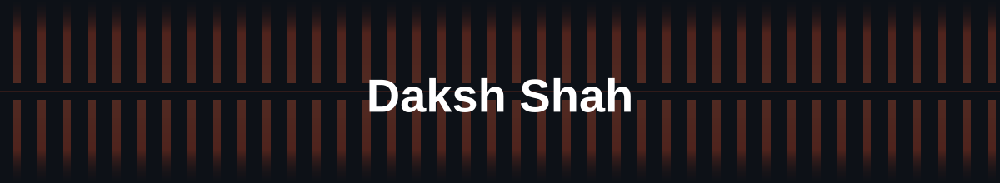

<!-- 
=======================================================================
WARNING: TO MAKE THE 3D GRAPH AND SNAKE ANIMATIONS WORK, 
YOU MUST SET UP THE GITHUB ACTIONS IN YOUR REPO AS EXPLAINED IN THE CHAT.
=======================================================================
-->

  

   

  

    

  I build robust, automated systems — from bare-metal microcontrollers to cloud infrastructure. 
  Currently exploring the intersection of IoT, edge computing, and DevOps.

   

  &nbsp;
  &nbsp;
  

---

## 🛠️ The Tech Arsenal
Core stack — tools I reach for daily.

  

 

## 🔬 Currently Exploring
Tinkered with, actively learning.

  

---

## 📊 GitHub Stats

  

---

## 🎲 Contributions in 3D

  <!-- This requires the 3D-Contrib Action to run in your repo -->
  

---

## 🐍 Contribution Snake

  <!-- This requires the Snk Action to run in your repo -->
  

   
  <i>"From microcontrollers to the cloud — I automate everything in between."</i>
    

